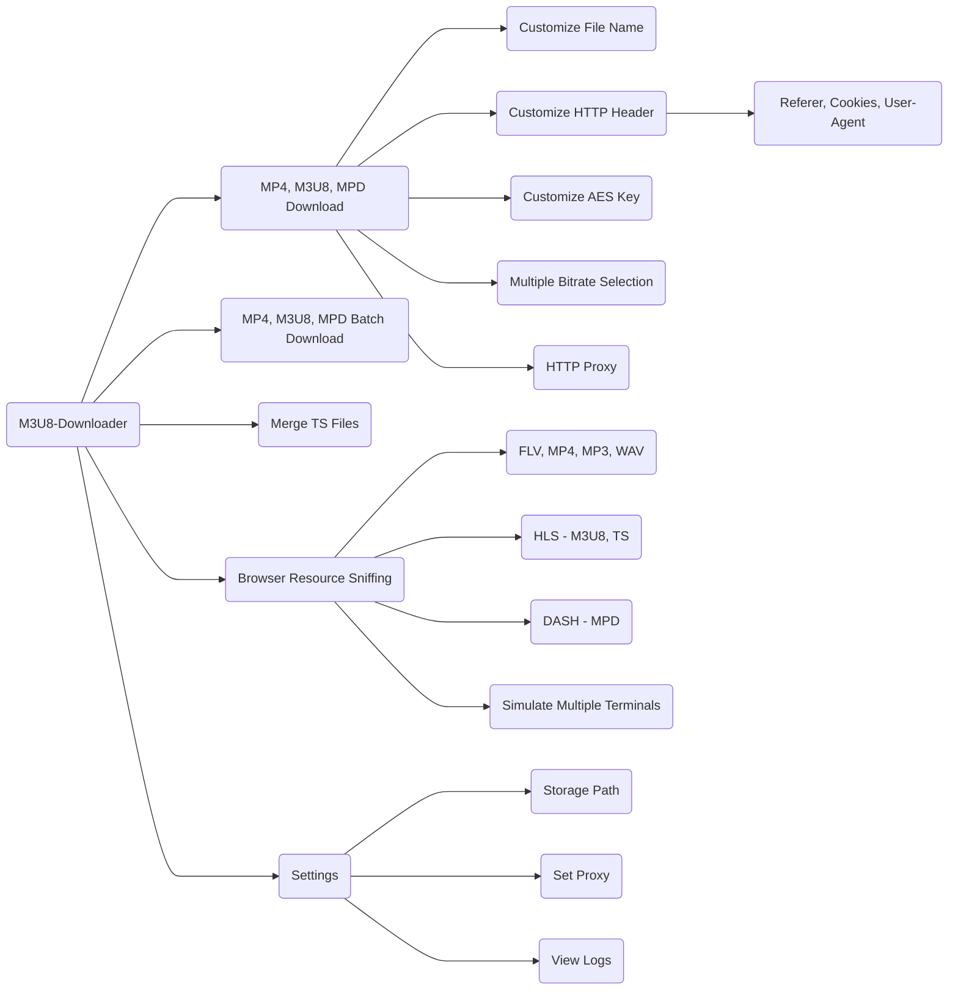

[](https://github.com/HeiSir2014/M3U8-Downloader/releases/latest)
[](https://github.com/HeiSir2014/M3U8-Downloader/releases/latest)
# M3U8-Downloader Direct Download
M3U8-Downloader is an application developed based on the Electron framework that allows downloading and playing HLS video streams. Its key features include the following:

| Feature                   | Supported |
| :------------------------ | --------: |
| HLS protocol VOD sources   |        ✓ |
| Custom HTTP header download|        ✓ |
| Custom KEY and IV decryption|        ✓ |
| Local M3U8 file download   |        ✓ |
| M3U8 live sources          |        ✓ |
| Standard AES-128-CBC encryption |   ✓ |
| Standard AES-196-CBC encryption |   ✓ |
| Standard AES-256-CBC encryption |   ✓ |
| Non-standard AES-*-CBC encryption |  ㄨ(customizable) |
| Webpage video source sniffing |  ✓ |


<div align="center">
    <br>
    
    <br>
</div>

# Feature Planning




---

# Obtaining M3U8 video URLs

To obtain the M3U8 video URL, open the video webpage in the Chrome browser, press F12, navigate to the Network tab, enter 'm3u8' in the Filter box, and then press F5 to refresh the page. If the video on the webpage uses HLS as its source, you can capture the video stream address here. Then, right-click on it, select 'Copy' -> 'Copy Link Address'.

By providing the M3U8 source address, you can download and losslessly transcode it into an MP4 file.

[Adding Custom Headers - Video Tutorial](https://player.bilibili.com/player.html?aid=498666070&bvid=BV1QK411n7VJ&cid=206827525&page=1)

# Download the executable package.

## Go to Baidu Netdisk for download.

```
Link：https://pan.baidu.com/s/14zaMkxgfTC0HSge-Ze6EpQ 
extraction code：m3u8 
```

## Download from GitHub.
## [Download from Releases](https://github.com/HeiSir2014/M3U8-Downloader/releases)

# Run the source code.
### Set up Node.js development environment

Install the latest version of Node.js.[NodeJs Download](http://nodejs.org/)

### Clone the code

Create a new folder in any directory to store the code and execute the following commands
```
cd newdir

git clone https://github.com/HeiSir2014/M3U8-Downloader.git .
```
### Yarn Environment Installation

```
npm install yarn -g
```

### Package Dependency Installation

```
yarn
```

ffmpeg-static installation timed out, you can try using a mirror:

```
FFMPEG_BINARIES_URL=https://cdn.npmmirror.com/binaries/ffmpeg-static yarn
```

### Run M3U8-Downloader

```
yarn start
```
### Packaging and Deployment

```
//Packaging for Windows Platform
yarn pack-win

//Packaging for Mac Platform
yarn pack-mac

```

### Enjoy it

### Donate

[Donation Link](https://tools.heisir.cn/HLSDownload/2019/07/08/02/)
